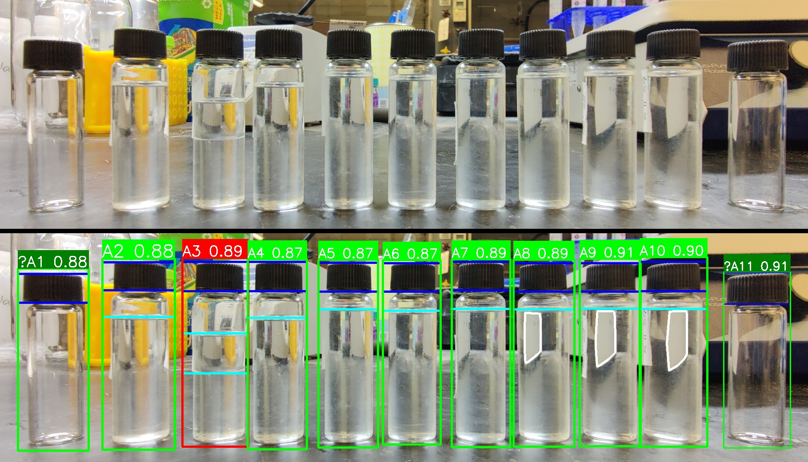
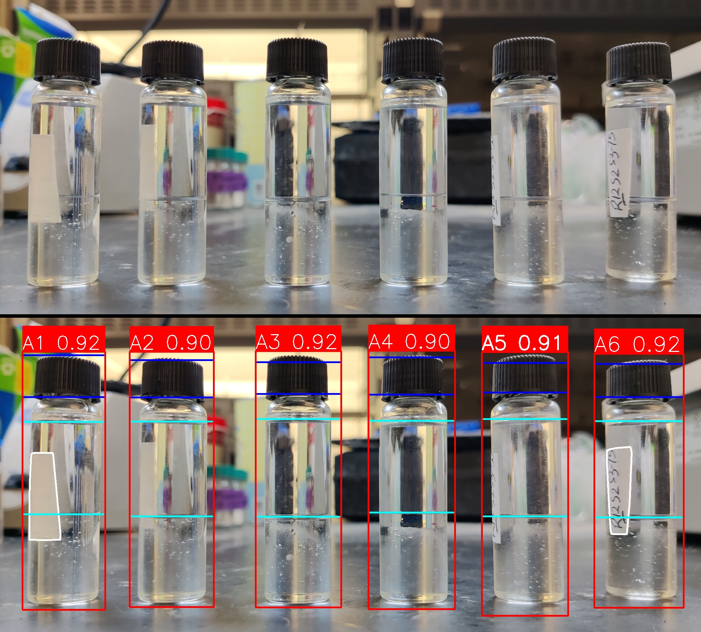

# Interface Detection for Liquid in a Vial

## Table of Contents
- [Interface Detection for Liquid in a Vial](#interface-detection-for-liquid-in-a-vial)
  - [Table of Contents](#table-of-contents)
  - [Overview](#overview)
  - [Citation](#citation)
  - [Structure](#structure)
  - [Installation](#installation)
  - [Usage](#usage)
    - [interface\_detection](#interface_detection)
    - [Vial Detection (External Dependency)](#vial-detection-external-dependency)
    - [Flask App](#flask-app)
  - [Limitations](#limitations)
  - [License](#license)

## Overview
This repository provides an edge-based method for detecting interfaces of an aqueous sample in a vial. It was initially developed for the [**autoHSP**](https://github.com/SijieFu/autoHSP) workflow to automate the result analysis through image processing. Check the [Citation](#citation) section to see how this method was applied.

The `interface detection` method is implemented with two modules:
1. `vial detection`: object detection algorithm to detect vials in a image and provide the bounding boxes. These bounding boxes are used to crop the vials for more focused analysis in the following module.
2. `edge-based interface detection`: Sobel gradients are used to analyze the (cropped) vial. The gradients, combined with color consistensy analysis, are used to outline the vial, locate the cap, denoise background-induced edges, find potential white labels, and finally filter out the interfaces.

This repository only contains the second module. An example `vial detection` module is implemented in a separate repository: [**SijieFu/vial-detection**](https://github.com/SijieFu/vial-detection). It uses fine-tuned YOLO models to detect vials in images and is licensed under [GPL-3.0](https://github.com/SijieFu/vial-detection/blob/main/LICENSE). See the [vial detection](#vial-detection-external-dependency) section for more details.

Here are some example images of the interface detection results:



## Citation
See the [**autoHSP**](https://github.com/SijieFu/autoHSP) project for citation information.

## Structure
```bash
interface-detection/
├── images/ # (not included) directory for images/analysis
├── interface_detection/ # **main module**
│   ├── __init__.py
│   ├── color_inference.py # for inferring cap color
│   ├── mask_to_contours.py # mask <--> contour conversion
│   ├── utils.py # utility functions
│   ├── vial_contour.py # edge-based interface detection
│   └── vial_detection.py # vial detection + interface detection
├── templates/ # html templates for the Flask app
│   └── img_upload_get.html # GET / (for debugging/demo)
├── tests/ # test resources
│   └── img/ # example images
├── .gitignore
├── debug_interfaces.py # `interface_detection.vial_contour.get_interfaces`
├── debug.py # `interface_detection.vial_detection.detect_interfaces`
├── download.py # script to download autoHSP images and analysis results
├── Flask_utils.py # Flask app utilities
├── Flask.py # Flask app for the interface detection API
├── info.py # configuration for the Flask app
├── README.md # this file
├── requirements.txt # Python package requirements
└── run.sh # wrapper script to start all services
```

## Installation
Python 3.12 is recommended for this project. The following instructions assume you have `conda` installed. You can also use other Python package managers.

1. Clone the repository:
    ```bash
    git clone https://github.com/SijieFu/interface-detection.git
    cd interface-detection
    ```
2. Create a new conda environment:
    ```bash
    conda create -n interface-detection python==3.12.10 -y
    conda activate interface-detection
    ```
3. Install the required packages:
    ```bash
    pip install -r requirements.txt
    ```
4. (Optional) Download the autoHSP images and analysis results:
    ```bash
    pip install gdown==5.2.0
    python download.py --all # this will download all resources
    ```
    If you have previously downloaded the resources and extracted them, you can skip this step. Otherwise, you may need to use `python download.py --all --overwrite` to overwrite the existing files.

## Usage
### interface_detection
The main module for interface detection is [**interface_detection**](interface_detection). The [interface_detection.vial_detection](interface_detection/vial_detection.py) script provides a wrapper for the interface detection process: [interface_detection.vial_contour.detect_interfaces](interface_detection/vial_detection.py#L178), which utilizes the following functions:
- [interface_detection.vial_detection.detect_vials](interface_detection/vial_detection.py#L32): detects vials in the image and returns their bounding boxes. See the [vial detection](#vial-detection-external-dependency) section for more details.
- [interface_detection.vial_contour.get_interfaces](interface_detection/vial_contour.py): detects the interfaces in a cropped vial image. It uses Sobel gradients to analyze the image and find the interfaces. **The input parameters to `get_interfaces` provide customization options for the interface detection process**.
  - [interface_detection.vial_contour.get_vessel_mask](interface_detection/vial_contour.py): extracts the vessel mask (and the background mask) from the cropped vial image.
  - [interface_detection.vial_contour.get_cap_range](interface_detection/vial_contour.py): return the top and bottom of the cap in the cropped vial image. The color of the cap is inferred with [interface_detection.color_inference.infer_cap_color](interface_detection/color_inference.py), but you can also specify the color of the cap with the `target` parameter provided to `get_cap_range`.
  - [interface_detection.vial_contour.compensate_for_background](interface_detection/vial_contour.py): finds background-induced edges within the vessel mask and removes them from the Sobel gradients for the vial.
  - [interface_detection.vial_contour.find_label_mask](interface_detection/vial_contour.py): finds the label mask in the cropped vial image. By default, a white label is assumed, but you can specify the color of the label with the `color_low` and `color_high` parameters.

For example, you can test the interface detection process with the following command:
```bash
python debug_interfaces.py -d
```

### Vial Detection (External Dependency)
For more general applications, you may need to detect vials in images, get the bounding boxes, and crop the vials out before using the [get_interfaces](interface_detection/vial_contour.py) function. This is because the interface detection method assumes that the image is focused on a single vial and that the gradients in the image are primarily from the vial itself, not from the background or other objects.

The [interface_detection.vial_detection.detect_vials](interface_detection/vial_detection.py#L32) function provides a wrapper for the vial detection process. It sends a POST request to the defined endpoint to get the bounding boxes of the vials in the image.

As an example, you can check the repository at [**SijieFu/vial-detection**](https://github.com/SijieFu/vial-detection). If you have a custom vial detection method, you can implement it as long as it provides the bounding boxes of the vials in the images. The expected API format is defined in [interface_detection.vial_detection.detect_vials](interface_detection/vial_detection.py#L32).

Once you have the external vial detection module set up, you can test the interface detection process with the following command:
```bash
python debug.py -d # add `-v <vial_detection_url>` if not at `http://localhost:5002/`
```

### Flask App
A Flask app is provided to demonstrate the interface detection process and host the API. You can run the Flask app with the following command:
```bash
bash run.sh # or ./run.sh
```
This will start the Flask app on <http://localhost:5001>. On your browser, you can access [the app](http://localhost:5001/) to test the API. To terminate the started services, you can run `bash run.sh --kill` or `./run.sh --kill`.

Note that by default, the Flask API was designed for the [**autoHSP**](https://github.com/SijieFu/autoHSP) project, and the default parameters are customized for the images collected in the autoHSP workflow. For regular use, you will need to add `usedefault=true` in the POST request form data to use the default parameters for the interface detection process. You can also access the app at <http://localhost:5001/?usedefault=true> to use the default parameters for the interface detection process. To get a JSON response, access the app at <http://localhost:5001/?usedefault=true&returnimage=false&returnjson=true>.

## Limitations
This module is designed for scintillation vials with aqueous samples, such as the ones in the [overview](#overview) section. It is assumed that:
- The vials are detectable and not too small.
- The vials are not significantly tilted, and the interface is horizontal.
- The angle of the camera is not too steep, so that the interface is not a wide arc. Otherwise, duplicated interfaces may be detected.
- The vials are properly capped, and the cap should have a uniform color. The cap should be on top of the vial, and the interface should be below the cap.
- The cap should be considerably wide compared to the vial itself, so that the cap can be properly detected. For bottles with narrow caps, the interface detection may not work as expected even though vial detection might work on them.
- The vial is not overfilled or underfilled. In other words, the interfaces should not be too close to the cap bottom or the vial bottom.
- The vials/containers themselves are transparent and do not have too many marks or labels on them.

## License
This project is licensed under the [**Apache-2.0**](LICENSE) license. Note that the [interface detection](interface_detection) module also requires an external vial detection module to work, unless the image of interest is exclusively focused on one vial ($\ge80\%$ of the image).

The [vial detection](https://github.com/SijieFu/vial-detection) module used in [autoHSP](https://github.com/SijieFu/autoHSP) is licensed under the [GPL-3.0](https://github.com/SijieFu/vial-detection/blob/main/LICENSE) license. You can use other vial detection methods as long as they provide the bounding boxes of the vials in the images. Check [interface_detection.vial_detection.detect_vials](interface_detection/vial_detection.py#L32) for the expected API format.
